<div align="center">

# SURE-EVALUATION

**创建可解释、可复现、可比较、可共享的评估链路。**

[](https://www.python.org/downloads/)
[](https://opensource.org/licenses/MIT)
[](https://github.com/PigeonDan1/sure-evaluation/actions/workflows/core.yml)
[](https://github.com/PigeonDan1/sure-evaluation/stargazers)

[English](./README.md) | [中文](./README_ZH.md) | [文档](./docs/) | [Open Bench](https://www.open-bench.net/sure)

</div>

## SURE-EVALUATION 是什么

SURE-EVALUATION 是一个通用的系统评估框架。它不仅集成了语音识别、
语音生成、语音增强、翻译、分类、语言理解等任务及其对应指标的评估工具，
同时将完整的评估过程节点化并进行版本管理。

你可以针对具体任务选择个性化的评估链路和节点工具，例如不同的
normalization、转录模型、格式转换或评分脚本。每一次评估都是一条从模型
输出到最终分数的完整链路，每个环节都会被严格记录并结构化展现。因此，
一个结果总能对应到产生它的确切输入、pipeline identity、节点顺序、配置和
报告。

框架采用轻量根包和独立可选节点环境的设计。它在支持广泛任务和工具的
同时，不会要求每位使用者安装所有模型与依赖。

## 为什么使用

- **全：** 一个框架覆盖文本、音频、生成、识别、翻译、分类和结构化检测等
  多类任务。
- **方便：** CLI 会列出可用链路、必需输入和环境要求；使用者只需准备精确
  pipeline 所选择的环境。
- **可信、可复查：** 每次运行都会记录 `pipeline_id`、有序计算节点、输入
  contract 和结构化输出。
- **可比较：** 结果依据同一条明确评估定义进行比较，而不是只依赖一个含义
  不充分的 metric 名称。
- **可定制、个性化：** 同一个 metric 可以注册多条 route，使用不同的 norm、
  模型、backend 或评分实现，而无需为计算方法重新发明 metric 名称。

## Pipeline 如何工作

SURE-EVALUATION 使用四类有序评估阶段；每条 route 只包含实际需要的阶段：

```text
音频或模型输出
    -> frontend       （可选的音频前端处理）
    -> transcription  （可选的音频到文本转录）
    -> normalization  （可选的文本规范化）
    -> scoring        （计算评估指标）
    -> report.json + pipeline_description.json
```

输入解析和格式检查由首个消费该输入的节点负责，并作为节点内部步骤记录，
不再单独构成 pipeline 阶段。

`pipeline_id` 使用 `任务.语种.metric.节点版本...` 表示一条精确计算流程，
例如：

```text
asr.en.wer.whisper_norm_english_v1.wenet_wer_v1
```

`metric` 始终使用全局规范名称，例如 `wer`、`cer`、`spk_sim`、`dnsmos`、
`wv_mos` 或 `utmos`。当两条 route 计算同一个 metric 时，因为节点链路不同，
它们的 `pipeline_id` 也不同。多指标请求是由多个原子 pipeline 组成的 bundle。

## 评估链路图谱

已提交的 catalog 可以绘制成一张全景图：每条原子 pipeline 是一条彩色链路，
从任务出发依次流经实际需要的 frontend、transcription、normalization、scoring
节点，最终落为一份 report。

<picture>
  <source media="(prefers-color-scheme: dark)" srcset="docs/atlas/pipeline_atlas_dark.svg">
  
</picture>

[`docs/atlas/index.html`](docs/atlas/index.html) 是同一张图的交互版本，支持
搜索、按任务筛选、悬停追踪和目录表格；克隆仓库后用浏览器打开即可。两种视图
均由 `docs/pipeline_catalog.jsonl` 生成：

```bash
python scripts/generate_pipeline_atlas.py
```

## 快速开始

SURE-EVALUATION 当前从源码安装，尚未发布到 PyPI。下面的命令会创建隔离
环境，并运行仓库内置的纯文本 ASR 示例；该示例不会下载模型，也不会创建
node-local 环境。

```bash
git clone https://github.com/PigeonDan1/sure-evaluation.git
cd sure-evaluation

python -m venv .venv
source .venv/bin/activate
python -m pip install --upgrade pip
python -m pip install -e .
python -m pip check
sure-eval doctor
```

查询所有英文 ASR WER route。输出会标记默认项，给出每条精确
`pipeline_id`、有序计算节点、必需输入和可选环境准备项：

```bash
sure-eval metric routes asr --language en --metric wer
```

选择一条精确 route，并生成可执行 pipeline JSON：

```bash
sure-eval metric describe asr \
  --pipeline-id asr.en.wer.whisper_norm_english_v1.wenet_wer_v1 \
  --output .sure-eval-demo/pipeline.json
```

查看准备计划，并只校验该精确 pipeline 使用的环境：

```bash
sure-eval env setup --pipeline .sure-eval-demo/pipeline.json --dry-run
sure-eval env check --pipeline .sure-eval-demo/pipeline.json
```

运行 pipeline 并查看结构化报告：

```bash
sure-eval metric run \
  --pipeline .sure-eval-demo/pipeline.json \
  --ref-file examples/readme/asr_en_ref.txt \
  --hyp-file examples/readme/asr_en_hyp.txt \
  --output-dir .sure-eval-demo/asr-en-wer \
  --validate-env

python -m json.tool .sure-eval-demo/asr-en-wer/report.json
python -m json.tool .sure-eval-demo/asr-en-wer/pipeline_description.json
```

发现结果、pipeline JSON、运行摘要、`report.json` 和
`pipeline_description.json` 中会出现同一个精确 `pipeline_id`。

## 选择和准备其他 Pipeline

使用规范 metric 名称查询不同实现，再选择需要运行的精确 `pipeline_id`：

```bash
# 三条中文 ASR CER 归一化与评分链路
sure-eval metric routes asr --language zh --metric cer

# 三种 TTS 说话人相似度 backend
sure-eval metric routes tts --language zh --metric spk_sim

# 同一个 macro_recall metric 的三种 KWS 输入 contract
sure-eval metric routes kws --metric macro_recall

# 稳定的机器可读发现结果
sure-eval metric routes tts --language zh --metric cer --json
```

对于包含可选模型或工具的 pipeline，只准备它所声明的节点：

```bash
sure-eval metric describe tts \
  --pipeline-id tts.zh.cer.qwen3_asr_1_7b_v1.punctuation_strip_norm_v1.wenet_cer_v1 \
  --output .sure-eval-demo/tts-qwen.json
sure-eval env setup --pipeline .sure-eval-demo/tts-qwen.json --dry-run
sure-eval env setup --pipeline .sure-eval-demo/tts-qwen.json
sure-eval env download --node transcription/qwen3_asr_1_7b --dry-run
sure-eval env download --node transcription/qwen3_asr_1_7b
sure-eval env check --pipeline .sure-eval-demo/tts-qwen.json
```

运行重节点前请阅读[安装说明](docs/installation.md)和
[环境管理](docs/environment.md)。环境 setup 负责安装声明的工具，模型资源
需要单独下载，并应先用 `env download --dry-run` 审阅。checkpoint、缓存和
node-local 虚拟环境只保留在本地，不会进入安装包或 Git。

## 支持的任务

| 任务 | 规范指标 | 指南 |
|:--|:--|:--|
| ASR | WER、CER、MER | [ASR](docs/tasks/asr.md) |
| S2TT | BLEU、BLEU-char、chrF、XCOMET-XL、BLEURT-20 | [S2TT](docs/tasks/s2tt.md) |
| SD | DER | [SD](docs/tasks/sd.md) |
| SV | EER、minDCF | [SV](docs/tasks/sv.md) |
| SA-ASR | cpWER，DER 伴随结果 | [SA-ASR](docs/tasks/sa_asr.md) |
| TTS | CER、WER、说话人相似度、DNSMOS、WV-MOS、UTMOS | [TTS](docs/tasks/tts.md) |
| VC | CER、WER、说话人相似度、DNSMOS、WV-MOS、UTMOS | [VC](docs/tasks/vc.md) |
| SE | SI-SDR、STOI、PESQ、DNSMOS、WV-MOS、UTMOS | [SE](docs/tasks/se.md) |
| TSE | SI-SDR、说话人相似度、DNSMOS、WV-MOS、UTMOS、CER、WER | [TSE](docs/tasks/tse.md) |
| Classification / SER / GR | Accuracy | [Classification](docs/tasks/classification.md) |
| SLU | Accuracy | [SLU](docs/tasks/slu.md) |
| KWS | Accuracy、macro recall、precision、recall、F1、FRR、FAR | [KWS](docs/tasks/kws.md) |
| VAD | F1、false alarm、miss、NIST DCF、ROC AUC | [VAD](docs/tasks/vad.md) |
| LID | 语种标签准确率 | [LID](docs/tasks/lid.md) |

每份任务指南都会说明输入 contract、已注册 metric、精确 pipeline ID、节点和
运行示例。自动生成的 [pipeline catalog](docs/pipeline_catalog.md) 包含已声明
语种 profile 下的全部注册原子 route，以及经过维护的多指标 bundle。

## 定制并分享

Route 定义在 `src/sure_eval/evaluation/tasks/<task>/routes.yaml`。节点元数据
位于 `src/sure_eval/evaluation/nodes/<stage>/<name>/manifest.yaml`，可选运行
环境则由同目录的 `node_env.yaml` 声明。新增 route 会改变路由和 identity
元数据，而具体计算仍由对应的版本化节点负责。

如果希望把自己的评估链路分享给社区，先阅读
[贡献指南](docs/contributing.md)。它会根据任务、metric、route、节点工具等
不同 PR 类型进入对应手册，并连接仓库 PR template。Agent 使用者还应遵循
[Agent Contract](docs/agent_contract.md)。

社区 pipeline 可以在 [Open Bench](https://www.open-bench.net/sure) 分享与
查看；使用情况和社区反馈能帮助合作者识别被广泛采用的评估链路。

来这里创建真正属于你的个性化评估链路，并让它可以被复查和共享。

## 许可证

MIT License。详见 [LICENSE](LICENSE)。
